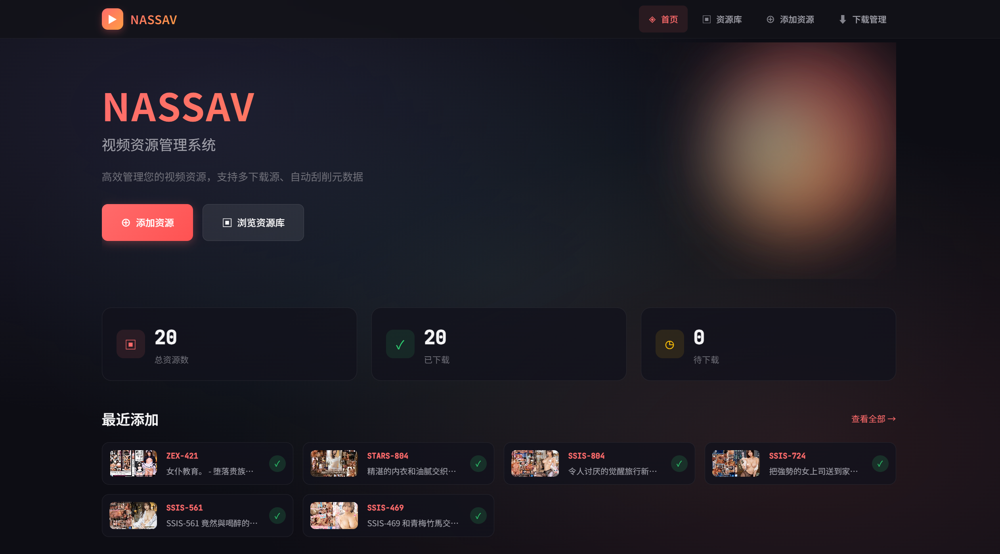
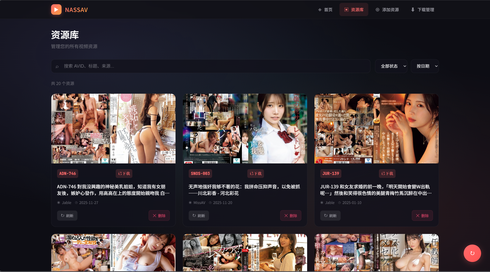
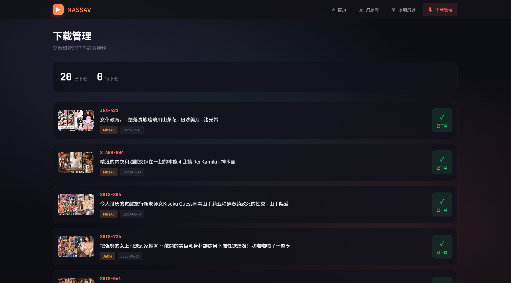

# NASSAV - AV 资源管理系统

一个全栈视频资源管理系统，支持多源资源获取、元数据刮削、异步下载队列以及现代化的 Web 界面管理。

> **原仓库**：本项目基于 [Satoing/NASSAV](https://github.com/Satoing/NASSAV) 重构开发，原项目保留在 `origin_project/` 目录下。

## 项目概览

NASSAV 是一个功能完整的视频资源管理系统，包括：

- **后端服务**（Django + Celery）：提供 RESTful API、异步下载队列、元数据管理
- **前端应用**（Vue 3 + Vite）：现代化的 Web 界面，支持资源浏览、搜索、下载管理
- **原项目**：原始 Python 实现，作为参考保留

## 功能特性

### 🎬 核心功能

- **多源资源获取**：支持 8+ 视频源（Jable、MissAV、Netflav、Kanav、Kissav、Memo、Hohoj、Avtoday），自动按权重遍历获取
- **元数据刮削**：从 JavBus 等站点获取详细信息（发行日期、演员、类别、封面等）
- **异步下载队列**：基于 Celery 的异步任务系统，支持 M3U8 流媒体下载
- **智能去重机制**：多层去重检查（Redis 锁 + Celery 队列），确保同一资源不重复下载
- **全局下载锁**：确保同一时间只有一个下载任务执行，避免资源竞争
- **资源管理**：按 AVID 分目录存储，统一管理视频文件、封面、元数据

### 🖥️ 前端界面

- **资源浏览**：卡片式展示，支持搜索、过滤、排序
- **资源详情**：查看完整元数据，一键下载或刷新
- **添加资源**：选择下载源添加新资源，实时查看处理状态
- **下载管理**：查看已下载清单，快速定位本地文件
- **Cookie 管理**：为需要认证的下载源设置 Cookie

## 页面预览

### 首页
展示资源总览统计、最近添加的资源以及快捷操作入口。



### 资源库
支持按 AVID/标题/来源搜索，按状态过滤，按日期/编号/来源排序，提供批量操作。



### 资源详情
展示完整的元数据信息，包括封面、演员、类别、文件大小等，支持下载和刷新操作。


### 添加资源
输入 AVID 并选择下载源，实时显示封面下载、元数据保存、信息刮削状态。


### 下载管理
查看已下载的资源列表，快速跳转到资源详情页。



## 技术栈

### 后端（django_backend/）

| 组件 | 版本 | 说明 |
|------|------|------|
| Python | 3.12+ | 运行环境 |
| Django | 5.1+ | Web 框架 |
| Django REST Framework | 3.15+ | API 框架 |
| Celery | 5.4+ | 异步任务队列 |
| Redis | - | 消息队列 & 分布式锁 |
| curl_cffi | - | HTTP 请求（绕过反爬） |
| N_m3u8DL-RE | - | M3U8 下载工具 |

### 前端（vue_frontend/）

| 组件 | 版本 | 说明 |
|------|------|------|
| Vue 3 | - | 前端框架 |
| Vite | 5+ | 构建工具 |
| Pinia | - | 状态管理 |
| Vue Router | - | 路由管理 |
| Axios | - | HTTP 请求 |

## 项目结构

```
NASSAV/
├── django_backend/          # Django 后端服务
│   ├── config/             # 配置文件
│   ├── django_project/     # Django 项目配置
│   ├── nassav/             # 主应用
│   │   ├── m3u8downloader/ # M3U8 下载器
│   │   ├── scraper/        # 元数据刮削器
│   │   └── source/         # 8 个下载源
│   ├── resource/           # 资源存储目录
│   │   └── {AVID}/        # 按 AVID 分目录
│   │       ├── {AVID}.html
│   │       ├── {AVID}.jpg
│   │       ├── {AVID}.json
│   │       └── {AVID}.mp4
│   └── tools/              # N_m3u8DL-RE 工具
├── vue_frontend/           # Vue 前端应用
│   ├── src/
│   │   ├── views/         # 页面组件
│   │   ├── components/    # 通用组件
│   │   ├── api/          # API 封装
│   │   ├── stores/       # Pinia 状态
│   │   └── router/       # 路由配置
│   └── public/           # 静态资源
└── origin_project/         # 原始项目（保留）
```

## 快速开始

### 前置要求

- Python 3.12+
- Node.js 18+
- Redis
- pnpm（推荐）或 npm

### 1. 后端设置

#### 安装依赖

```bash
cd django_backend
uv sync  # 或 pip install -r requirements.txt
```

#### 配置文件

```bash
cp config/template-config.yaml config/config.yaml
# 编辑 config.yaml，配置代理、刮削器、下载源等
```

#### 下载工具

下载 [N_m3u8DL-RE](https://github.com/nilaoda/N_m3u8DL-RE/releases) 并放置到 `tools/` 目录：

```bash
mkdir -p tools
# 下载对应平台的 N_m3u8DL-RE 并放入 tools/
chmod +x tools/N_m3u8DL-RE  # Linux/macOS
```

#### 启动 Redis

```bash
# Ubuntu/Debian
sudo systemctl start redis

# macOS
brew services start redis

# Windows
# 使用 WSL 或下载 Windows 版 Redis
```

#### 启动服务

```bash
# 启动 Django 服务（端口 8000）
uv run python manage.py runserver 0.0.0.0:8000

# 启动 Celery Worker（新终端）
uv run celery -A django_project worker -l info
```

### 2. 前端设置

#### 安装依赖

```bash
cd vue_frontend
pnpm install  # 或 npm install
```

#### 启动开发服务器

```bash
pnpm dev  # 默认端口 8080
```

开发代理已配置：`/nassav` → `http://localhost:8000`

### 3. 访问应用

打开浏览器访问：http://localhost:8080

## API 文档

详细接口说明请参考 [django_backend/interfaces.md](django_backend/interfaces.md)

主要端点：

| 方法 | 端点 | 说明 |
|------|------|------|
| GET | `/api/source/list` | 获取可用下载源列表 |
| POST | `/api/source/cookie` | 设置下载源 Cookie |
| GET | `/api/resource/list` | 获取所有资源列表 |
| GET | `/api/resource/cover` | 获取封面图片 |
| POST | `/api/resource` | 添加新资源 |
| POST | `/api/resource/refresh` | 刷新资源元数据 |
| GET | `/api/downloads/list` | 获取已下载列表 |
| POST | `/api/downloads` | 提交下载任务 |

## 生产部署

### 后端部署

```bash
# 使用 uWSGI 或 Gunicorn
gunicorn django_project.wsgi:application --bind 0.0.0.0:8000

# Celery Worker（后台运行）
celery -A django_project worker -l info --detach
```

### 前端部署

```bash
cd vue_frontend
pnpm build  # 构建到 dist/
```

使用 Nginx 部署示例：

```nginx
server {
  listen 80;
  server_name your-domain.com;

  # 前端静态文件
  root /var/www/nassav/vue_frontend/dist;
  index index.html;

  # SPA 路由回退
  location / {
    try_files $uri $uri/ /index.html;
  }

  # API 反向代理
  location /nassav/ {
    proxy_pass http://127.0.0.1:8000/;
    proxy_set_header Host $host;
    proxy_set_header X-Real-IP $remote_addr;
    proxy_set_header X-Forwarded-For $proxy_add_x_forwarded_for;
  }
}
```

## 常见问题

### 后端相关

**Q: Celery 任务队列中出现重复任务？**

A: 系统已实现多层去重机制（Redis 锁 + Celery 队列检查），正常情况下不会出现重复。如果仍有问题，检查 Redis 连接状态。

**Q: 下载任务卡住不动？**

A: 检查 N_m3u8DL-RE 是否正确安装，查看 Celery Worker 日志，确认全局下载锁是否正常释放。

**Q: 某些源无法获取资源？**

A: 部分源需要设置 Cookie，在前端"添加资源"页面的 Cookie 设置中配置。

### 前端相关

**Q: 刷新页面出现 404？**

A: SPA 应用需要配置服务器将所有路径回退到 `index.html`（参考上方 Nginx 配置）。

**Q: 接口请求失败或跨域？**

A: 确认后端服务正在运行，检查代理配置或 CORS 设置。

**Q: 开发端口冲突？**

A: 修改 `vue_frontend/vite.config.js` 中的 `server.port`。

### 下载源相关

**Q: 哪些源比较好用？**

A: 就目前来说，**missav**品类最全但是需要手动获取设置cookie，jable其次并且可以自动获取cookie，memo不需要设置cookie但是没有中文字幕，其余的源缺乏良好支持。

## 开发指南

### 添加新的下载源

1. 在 `django_backend/nassav/source/` 创建新的源类，继承 `SourceBase`
2. 实现 `get_download_info()` 方法
3. 在 `SourceManager` 中注册新源
4. 在 `config.yaml` 中配置权重

### 添加新的刮削器

1. 在 `django_backend/nassav/scraper/` 创建新的刮削器类
2. 实现元数据解析逻辑
3. 在 `ScraperManager` 中注册

## 许可证

本项目基于原仓库 [Satoing/NASSAV](https://github.com/Satoing/NASSAV) 重构开发，遵循相同的许可证。

## 致谢

感谢 [Satoing/NASSAV](https://github.com/Satoing/NASSAV) 原项目的启发和基础代码。
