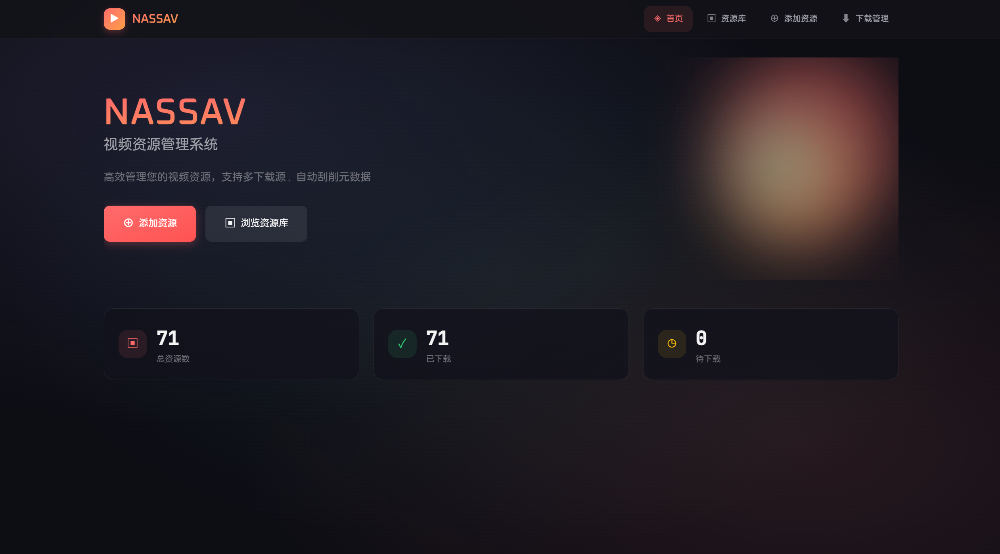
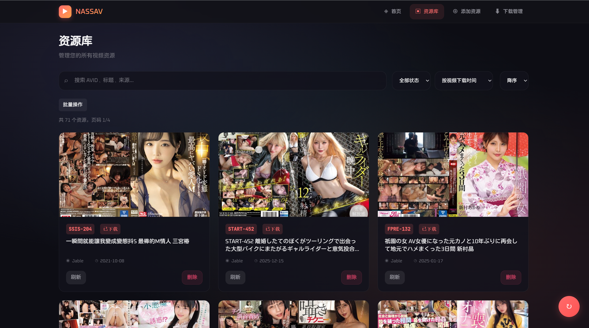
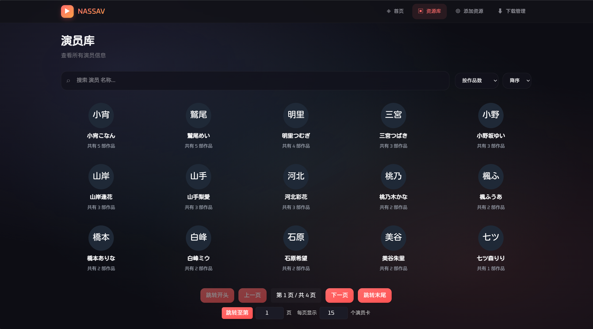
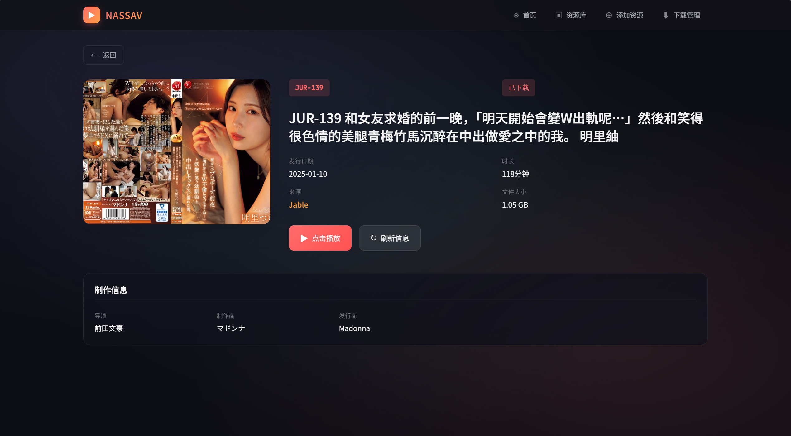
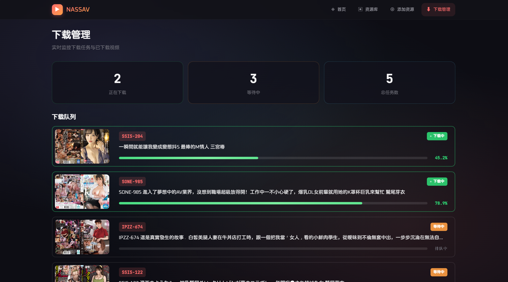

# NASSAV - AV 资源管理系统

一个功能完整的全栈视频资源管理系统，支持多源资源获取、元数据刮削、异步下载队列、实时进度追踪以及现代化的 Web 界面管理。

> **原仓库**：本项目基于 [Satoing/NASSAV](https://github.com/Satoing/NASSAV) 重构开发，原项目保留在 `origin_project/` 目录下。

## 项目概览

NASSAV 是一个功能完整的视频资源管理系统，包括：

- **后端服务**（Django + Celery + WebSocket）：提供 RESTful API、异步下载队列、实时进度追踪、元数据管理
- **前端应用**（Vue 3 + Vite）：现代化的 SPA 界面，支持资源浏览、按演员/类别聚合、搜索过滤、批量操作
- **原项目**：原始 Python 实现，作为参考保留

## 功能特性

### 🎬 核心功能

- **多源资源获取**：支持 8+ 视频源（Jable、MissAV、Memo 等），自动按权重遍历获取
- **元数据刮削**：从 JavBus 等站点获取详细信息（发行日期、时长、演员、类别、封面等）
- **异步下载队列**：基于 Celery 的异步任务系统，支持 M3U8 流媒体下载
- **实时进度追踪**：从 N_m3u8DL-RE 解析下载进度，支持 REST API 查询和 WebSocket 实时推送
- **智能去重机制**：多层去重检查（Redis 锁 + Celery 队列检查），确保同一 AVID 在队列中只出现一次
- **全局下载锁**：确保同一时间只有一个下载任务执行，避免 N_m3u8DL-RE 多实例并发
- **并发控制**：Celery Worker 配置为单并发，下载任务串行执行
- **统一资源管理**：按 AVID 分目录存储，封面/视频/元数据集中管理
- **WebSocket 实时通知**：前端可实时接收任务状态、下载进度、完成通知

### 🖥️ 前端界面

- **资源浏览**：卡片式展示，支持搜索（AVID/标题）、过滤（状态/来源）、排序（日期/编号/来源）
- **演员聚合**：按演员分类浏览，展示每个演员的作品数，支持搜索和排序
- **类别聚合**：按类别分类浏览，展示每个类别的作品数，支持搜索和排序
- **批量操作**：批量下载、批量刷新、批量删除，支持选择模式
- **资源详情**：查看完整元数据（封面、演员、类别、文件大小等），一键下载或刷新
- **添加资源**：选择下载源添加新资源，实时显示封面下载/元数据保存/信息刮削状态
- **下载管理**：查看已下载清单，快速复制本地文件路径
- **Cookie 管理**：为需要认证的下载源设置 Cookie

## 页面预览

### 首页
展示资源总览统计、最近添加的资源以及快捷操作入口。



### 资源库
支持按 AVID/标题/来源搜索，按状态过滤，按日期/编号/来源排序，提供批量操作（下载、刷新、删除），支持按演员/类别分类浏览。



### 演员库
展示所有演员及其作品数，支持搜索演员名称，按作品数或名称排序，点击演员卡片可查看该演员的所有作品。



### 资源详情
展示完整的元数据信息，包括封面、演员、类别、文件大小等，支持下载和刷新操作。



### 添加资源
输入 AVID 并选择下载源，实时显示封面下载、元数据保存、信息刮削状态。


### 下载管理
查看已下载的资源列表，快速跳转到资源详情页。



## 技术栈

### 后端（django_backend/）

| 组件 | 版本 | 说明 |
|------|------|------|
| Python | 3.12+ | 运行环境 |
| Django | 5.1+ | Web 框架 |
| Django REST Framework | 3.15+ | API 框架 |
| Django Channels | 4.3+ | WebSocket 支持 |
| Celery | 5.4+ | 异步任务队列 |
| Redis | - | 消息队列 & 分布式锁 & Channel Layer |
| curl_cffi | - | HTTP 请求（绕过反爬） |
| N_m3u8DL-RE | - | M3U8 下载工具 |

### 前端（vue_frontend/）

| 组件 | 版本 | 说明 |
|------|------|------|
| Vue 3 | - | 前端框架 |
| Vite | 5+ | 构建工具 |
| Pinia | - | 状态管理 |
| Vue Router | - | 路由管理 |
| Axios | - | HTTP 请求 |

## 项目结构

```
NASSAV/
├── django_backend/          # Django 后端服务
│   ├── config/             # 配置文件
│   │   ├── config.yaml    # 应用配置
│   │   └── template-config.yaml  # 配置模板
│   ├── django_project/     # Django 项目配置
│   │   ├── settings.py    # Django 配置
│   │   ├── celery.py      # Celery 配置
│   │   └── asgi.py        # ASGI 配置（WebSocket）
│   ├── nassav/             # 主应用
│   │   ├── m3u8downloader/ # M3U8 下载器
│   │   ├── scraper/        # 元数据刮削器（JavBus等）
│   │   ├── source/         # 8 个下载源（Jable、MissAV等）
│   │   ├── models.py       # 数据模型（AVResource、Actor、Genre）
│   │   ├── views.py        # API 视图
│   │   ├── services.py     # 业务逻辑
│   │   ├── tasks.py        # Celery 异步任务
│   │   ├── consumers.py    # WebSocket 消费者
│   │   └── urls.py         # API 路由
│   ├── resource/           # 资源存储目录（新布局）
│   │   ├── cover/         # 封面图片，格式：{AVID}.jpg
│   │   │   └── thumbnails/ # 缩略图（small/medium/large）
│   │   ├── video/         # 视频文件，格式：{AVID}.mp4
│   │   └── resource_backup/ # 旧布局备份（HTML/JSON/MP4）
│   ├── tools/              # 工具目录
│   │   └── N_m3u8DL-RE   # M3U8 下载工具
│   ├── doc/               # 文档
│   │   ├── interface.md   # API 接口文档
│   │   └── database.md    # 数据库文档
│   └── scripts/           # 实用脚本
├── vue_frontend/           # Vue 前端应用
│   ├── src/
│   │   ├── views/         # 页面组件
│   │   │   ├── HomeView.vue          # 首页
│   │   │   ├── ResourcesView.vue     # 资源库
│   │   │   ├── ActorsView.vue        # 演员库
│   │   │   ├── GenresView.vue        # 类别库（待实现）
│   │   │   ├── ActorDetailView.vue   # 演员详情
│   │   │   ├── ResourceDetailView.vue # 资源详情
│   │   │   ├── AddResourceView.vue   # 添加资源
│   │   │   └── DownloadsView.vue     # 下载管理
│   │   ├── components/    # 通用组件
│   │   │   ├── ResourceCard.vue      # 资源卡片
│   │   │   ├── ActorGroupCard.vue    # 演员卡片
│   │   │   ├── GenreGroupCard.vue    # 类别卡片（待实现）
│   │   │   └── BatchControls.vue     # 批量操作控件
│   │   ├── stores/        # Pinia 状态管理
│   │   │   ├── resource.js           # 资源状态
│   │   │   ├── actorGroups.js        # 演员组状态
│   │   │   └── genreGroups.js        # 类别组状态（待实现）
│   │   ├── api/          # API 封装
│   │   └── router/       # 路由配置
│   └── public/preview/   # 预览截图
└── origin_project/         # 原始项目（保留）
```

## 快速开始

### 前置要求

- Python 3.12+
- Node.js 18+
- Redis
- pnpm（推荐）或 npm

### 1. 后端设置

#### 安装依赖

```bash
cd django_backend
uv sync  # 或 pip install -r requirements.txt
```

#### 配置文件

```bash
cp config/template-config.yaml config/config.yaml
# 编辑 config.yaml，配置代理、刮削器、下载源等
```

#### 下载工具

下载 [N_m3u8DL-RE](https://github.com/nilaoda/N_m3u8DL-RE/releases) 并放置到 `tools/` 目录：

```bash
mkdir -p tools
# 下载对应平台的 N_m3u8DL-RE 并放入 tools/
chmod +x tools/N_m3u8DL-RE  # Linux/macOS
```

#### 启动 Redis

```bash
# Ubuntu/Debian
sudo systemctl start redis

# macOS
brew services start redis

# Windows
# 使用 WSL 或下载 Windows 版 Redis
```

#### 启动服务

**方式一：使用 ASGI 服务器（推荐，支持 WebSocket）**

```bash
# 使用 Uvicorn（推荐）
uv run uvicorn django_project.asgi:application --host 0.0.0.0 --port 8000 --reload

# 或使用 Daphne
uv run daphne -b 0.0.0.0 -p 8000 django_project.asgi:application
```

**方式二：使用 Django 开发服务器（不支持 WebSocket）**

```bash
uv run python manage.py runserver 0.0.0.0:8000
```

**注意**：如果要使用 WebSocket 实时通知功能，必须使用 ASGI 服务器（Uvicorn 或 Daphne）。

#### 启动 Celery Worker（异步下载）

```bash
# 标准启动（已配置单并发）
uv run celery -A django_project worker -l info

# 或手动指定并发数为 1
uv run celery -A django_project worker -l info --concurrency=1
```

**重要说明**：
- Worker 已配置为单并发模式（`CELERY_WORKER_CONCURRENCY=1`）
- 全局下载锁确保同一时间只有一个 N_m3u8DL-RE 实例在运行
- 任务去重机制防止同一 AVID 重复提交到队列

### 2. 前端设置

#### 安装依赖

```bash
cd vue_frontend
pnpm install  # 或 npm install
```

#### 启动开发服务器

```bash
pnpm dev  # 默认端口 8080
```

开发代理已配置：`/nassav` → `http://localhost:8000`

### 3. 访问应用

打开浏览器访问：http://localhost:8080

## API 文档

详细接口说明请参考：
- [django_backend/doc/interface.md](django_backend/doc/interface.md) - API 接口文档
- [django_backend/doc/database.md](django_backend/doc/database.md) - 数据库模型文档

### REST API 端点

| 方法 | 端点 | 说明 |
|------|------|------|
| GET | `/api/source/list` | 获取可用下载源列表 |
| POST | `/api/source/cookie` | 设置下载源 Cookie |
| GET | `/api/resource/list` | 获取所有资源列表（旧版） |
| GET | `/api/resources/` | 资源列表（支持搜索/筛选/分页/排序） |
| GET | `/api/actors/` | 演员列表（支持搜索/分页/排序） |
| GET | `/api/genres/` | 类别列表（支持搜索/分页/排序，待实现） |
| GET | `/api/resource/cover` | 获取封面图片（支持多尺寸） |
| GET | `/api/resource/<avid>/preview` | 资源详情首屏预览 |
| POST | `/api/resource` | 添加新资源 |
| POST | `/api/resource/refresh/<avid>` | 刷新资源元数据 |
| DELETE | `/api/resource/<avid>` | 删除资源 |
| POST | `/api/resources/batch` | 批量资源操作（add/refresh/delete） |
| GET | `/api/downloads/list` | 获取已下载列表 |
| GET | `/api/downloads/abspath` | 获取视频文件绝对路径 |
| POST | `/api/downloads/<avid>` | 提交下载任务 |
| DELETE | `/api/downloads/<avid>` | 删除已下载视频 |
| POST | `/api/downloads/batch_submit` | 批量提交下载任务 |
| GET | `/api/tasks/queue/status` | 获取任务队列状态（含进度） |

### WebSocket 端点

| 端点 | 说明 |
|------|------|
| `ws://localhost:8000/nassav/ws/tasks/` | 实时任务队列通知和下载进度推送 |

**消息类型**：
- `progress_update` - 下载进度实时更新（百分比、速度）
- `task_started` - 任务开始通知
- `task_completed` - 任务完成通知
- `task_failed` - 任务失败通知
- `queue_status` - 队列状态更新

## 生产部署

### 后端部署

**使用 ASGI 服务器（支持 WebSocket）：**

```bash
# 使用 Uvicorn（推荐）
uvicorn django_project.asgi:application --host 0.0.0.0 --port 8000 --workers 4

# 或使用 Daphne
daphne -b 0.0.0.0 -p 8000 django_project.asgi:application

# Celery Worker（后台运行）
celery -A django_project worker -l info --detach --concurrency=1
```

**使用传统 WSGI 服务器（不支持 WebSocket）：**

```bash
# 使用 Gunicorn
gunicorn django_project.wsgi:application --bind 0.0.0.0:8000 --workers 4

# Celery Worker（后台运行）
celery -A django_project worker -l info --detach --concurrency=1
```

### 前端部署

```bash
cd vue_frontend
pnpm build  # 构建到 dist/
```

使用 Nginx 部署示例：

```nginx
server {
  listen 80;
  server_name your-domain.com;

  # 前端静态文件
  root /var/www/nassav/vue_frontend/dist;
  index index.html;

  # SPA 路由回退
  location / {
    try_files $uri $uri/ /index.html;
  }

  # API 反向代理
  location /nassav/ {
    proxy_pass http://127.0.0.1:8000/;
    proxy_http_version 1.1;
    # WebSocket 支持
    proxy_set_header Upgrade $http_upgrade;
    proxy_set_header Connection "upgrade";
    proxy_set_header Host $host;
    proxy_set_header X-Real-IP $remote_addr;
    proxy_set_header X-Forwarded-For $proxy_add_x_forwarded_for;
    proxy_set_header X-Forwarded-Proto $scheme;
  }
}
```

## 常见问题

### 后端相关

**Q: Celery 任务队列中出现重复任务？**

A: 系统已实现多层去重机制（Redis 锁 + Celery 队列检查），正常情况下不会出现重复。如果仍有问题，检查 Redis 连接状态。

**Q: 下载任务卡住不动？**

A: 检查 N_m3u8DL-RE 是否正确安装，查看 Celery Worker 日志，确认全局下载锁是否正常释放。可以通过 Redis 手动清理锁：`redis-cli DEL nassav:global_download_lock`。

**Q: WebSocket 连接失败？**

A: 确保使用 ASGI 服务器（Uvicorn 或 Daphne），而不是传统的 WSGI 服务器。检查 Nginx 配置是否包含 WebSocket 支持的头信息。

**Q: 某些源无法获取资源？**

A: 部分源需要设置 Cookie，在前端"添加资源"页面的 Cookie 设置中配置。就目前来说，**missav** 品类最全但需要手动设置 cookie，**jable** 其次并且可以自动获取 cookie，**memo** 不需要设置 cookie 但是没有中文字幕。

### 前端相关

**Q: 刷新页面出现 404？**

A: SPA 应用需要配置服务器将所有路径回退到 `index.html`（参考上方 Nginx 配置）。

**Q: 接口请求失败或跨域？**

A: 确认后端服务正在运行，检查代理配置（开发环境）或 CORS 设置（生产环境）。

**Q: 开发端口冲突？**

A: 修改 `vue_frontend/vite.config.js` 中的 `server.port`。

**Q: 实时进度不更新？**

A: 确保后端使用 ASGI 服务器，前端 WebSocket 连接成功。可以在浏览器开发者工具的网络标签中查看 WebSocket 连接状态。

### 下载源相关

**Q: 哪些源比较好用？**

A: 就目前来说，**missav** 品类最全但是需要手动获取设置 cookie，**jable** 其次并且可以自动获取 cookie，**memo** 不需要设置 cookie 但是没有中文字幕，其余的源缺乏良好支持。

## 开发指南

### 添加新的下载源

1. 在 `django_backend/nassav/source/` 创建新的源类，继承 `SourceBase`
2. 实现 `get_download_info()` 方法
3. 在 `SourceManager` 中注册新源
4. 在 `config.yaml` 中配置权重

### 添加新的刮削器

1. 在 `django_backend/nassav/scraper/` 创建新的刮削器类
2. 实现元数据解析逻辑
3. 在 `ScraperManager` 中注册

### 实时进度追踪

系统通过以下方式实现下载进度的实时追踪：

1. **进度解析**：从 N_m3u8DL-RE 的标准输出实时解析进度信息（百分比、速度）
2. **Redis 存储**：将进度数据存储到 Redis，键名格式：`nassav:task_progress:{AVID}`
3. **WebSocket 推送**：每次进度更新时通过 Channel Layer 推送到所有连接的客户端
4. **REST API 查询**：通过 `GET /api/tasks/queue/status` 查询当前任务进度
5. **自动清理**：任务完成后自动删除进度数据，或 1 小时后自动过期

#### 前端集成示例

**WebSocket 实时订阅（推荐）：**

```javascript
const ws = new WebSocket('ws://localhost:8000/nassav/ws/tasks/');

ws.onmessage = (event) => {
    const message = JSON.parse(event.data);

    switch (message.type) {
        case 'progress_update':
            // 实时进度更新
            const {avid, percent, speed} = message.data;
            console.log(`${avid}: ${percent}% @ ${speed}`);
            updateProgressBar(avid, percent);
            break;

        case 'task_completed':
            // 下载完成
            console.log(`Task ${message.data.avid} completed`);
            break;

        case 'queue_status':
            // 队列状态更新
            updateQueueDisplay(message.data);
            break;
    }
};
```

**REST API 轮询（备选）：**

```javascript
// 定期查询任务状态（包含进度信息）
setInterval(async () => {
    const response = await fetch('/nassav/api/tasks/queue/status');
    const {data} = await response.json();

    data.active_tasks.forEach(task => {
        if (task.progress) {
            console.log(`${task.avid}: ${task.progress.percent}%`);
            updateProgressBar(task.avid, task.progress.percent);
        }
    });
}, 2000); // 每 2 秒查询一次
```

### 任务去重与并发控制

系统采用多层去重策略，确保同一 AVID 在整个任务队列中只出现一次：

1. **Redis 任务锁**：提交任务时创建 `nassav:task_lock:{AVID}` 键
2. **Celery 队列检查**：检查 active、scheduled、reserved 三种状态的任务
3. **参数精确匹配**：通过任务名称和 AVID 参数精确识别重复任务

全局下载锁确保同一时间只有一个下载任务在执行，避免 N_m3u8DL-RE 多实例并发导致的资源竞争。

## 版本更新

### v1.2.0（2026-01-02）

#### 🎯 核心功能增强

**后端新特性：**
- ✨ **细粒度刷新控制**：支持独立刷新 m3u8、元数据、翻译（3个开关互不干扰）
- 🔄 **批量操作接口**：支持批量添加、刷新、删除资源，批量提交下载任务
- 🌐 **AI 智能翻译系统**：基于 Ollama 的日译中标题翻译，支持批量翻译和异步任务
- 🗂️ **source_title 规范化**：统一 AVID 格式（大写 + 前缀），保证数据一致性
- 📝 **DisplayTitle 配置**：支持通过配置文件选择显示标题类型（source_title/translated_title/title）
- 🎛️ **Translator 配置系统**：支持多翻译器配置，可通过 config.yaml 激活不同模型

**前端新特性：**
- ✨ **批量添加资源**：支持一次性输入多个 AVID（换行、逗号或空格分隔），自动去重和格式化
- 🎨 **刷新操作多选项**：刷新元数据时可选择刷新方式（仅本地、Ollama、DeepL、ChatGPT等）
- 🏠 **首页美化**：采用渐变配色、浮动动画背景、现代化卡片设计
- 🎭 **类别标签优化**：以 hashtag 形式展示资源类别，更直观
- 🧭 **导航菜单增强**：资源库新增下拉菜单，可快速导航至"按演员"和"按类别"视图
- ↩️ **返回逻辑优化**：返回按钮跳转至来源页面而非固定路由

#### 🐛 Bug 修复

- 🔧 **下载队列显示修复**：修复任务队列显示 Bug（任务数量和状态显示错误）
- 🔄 **WebSocket 连接优化**：改进 WebSocket 连接和 HTTP 轮询逻辑
- 🏷️ **任务状态同步**：改进任务状态同步机制，添加 AVID-名称缓存，减少重复请求

#### ⚡ 性能优化

- 🖼️ **封面加载优化**：优先使用后端提供的 thumbnail_url，减少 Blob 下载
- 💾 **智能缓存策略**：AVID-名称映射缓存，避免重复请求元数据
- 🧹 **翻译质量提升**：添加翻译结果清洗机制（10+ 清洗规则），移除前缀、注释、格式标记
- 🔄 **条件请求优化**：元数据和封面接口支持 ETag/Last-Modified，减少带宽占用

#### 📊 数据库与架构

- 📑 **数据库全面迁移**：所有元数据从文件系统迁移至 SQLite，统一通过 ORM 访问
- 🏷️ **演员类别聚合**：新增演员列表、类别列表 API，支持按作品数排序和搜索
- 🖼️ **智能缩略图生成**：按需生成多尺寸封面（small/medium/large），支持 ETag 缓存

#### 💻 代码质量提升

- ✅ **ESLint 代码检查**：配置 ESLint 9.39.2 + Vue 插件，添加 `pnpm lint` 和 `pnpm lint:fix` 命令
- 🧹 **代码清理**：移除未使用的变量、导入和函数，修复空 catch 块，添加缺失的 emits 声明
- 🔧 **代码优化**：移除无用的 try-catch 包装，修复模板变量遮蔽问题
- 🧪 **完整测试覆盖**：新增翻译清洗、序列化器、API 端点等测试用例

#### 📝 文档更新

- 📖 更新 API 文档，新增细粒度刷新、批量操作接口说明
- 📚 完善配置文档，添加翻译器和 DisplayTitle 配置说明
- 🗂️ 新增数据库迁移和规范化脚本文档

---

### v1.1.0

**新增功能：**
- ✨ **演员聚合浏览**：新增演员库页面，按演员分类浏览资源，支持搜索和排序
- ✨ **类别聚合浏览**：新增类别库页面（前端待完善），按类别分类浏览资源
- ✨ **演员/类别详情页**：点击演员/类别卡片可查看该演员/类别的所有作品
- ✨ **批量操作组件化**：封装统一的批量操作控件，支持批量下载、刷新、删除
- ✨ **实时进度追踪**：WebSocket 实时推送下载进度，支持百分比和速度显示
- 🔧 **后端 API 增强**：
  - `GET /api/actors/` - 演员列表及作品数统计
  - `GET /api/genres/` - 类别列表及作品数统计
  - `GET /api/resources/?actor=<id|name>` - 按演员过滤资源
  - `GET /api/resources/?genre=<id|name>` - 按类别过滤资源
  - `ws://host/nassav/ws/tasks/` - WebSocket 实时通知
- 🎨 **UI/UX 优化**：统一的卡片设计风格，更流畅的交互体验

**改进：**
- 📊 数据库结构优化：添加索引提升查询性能
- 🔒 增强的去重机制：多层去重保证任务唯一性
- 🚀 缩略图支持：封面支持多尺寸（small/medium/large）按需生成
- 📝 完善的文档：更新 API 文档和数据库文档

---

### v1.0.0

- 🎬 多源资源获取（8+ 下载源）
- 🔍 元数据刮削（JavBus 等）
- 📥 异步下载队列（Celery）
- 🖥️ 现代化前端界面（Vue 3 + Vite）
- 📁 统一资源管理

## 许可证

本项目基于原仓库 [Satoing/NASSAV](https://github.com/Satoing/NASSAV) 重构开发，遵循相同的许可证。

## 致谢

感谢 [Satoing/NASSAV](https://github.com/Satoing/NASSAV) 原项目的启发和基础代码。
