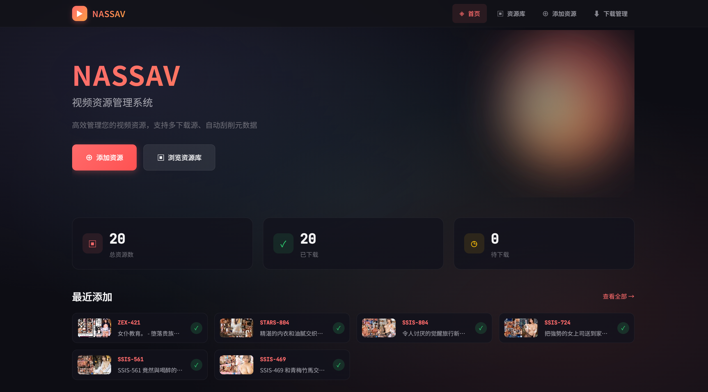
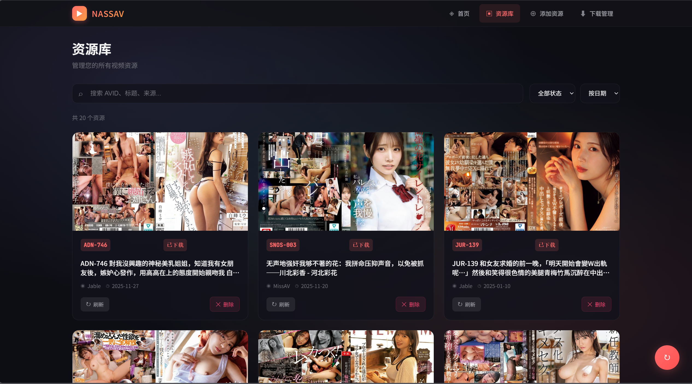
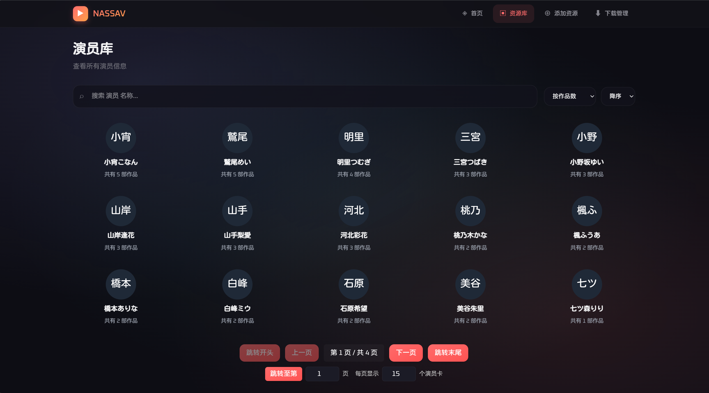
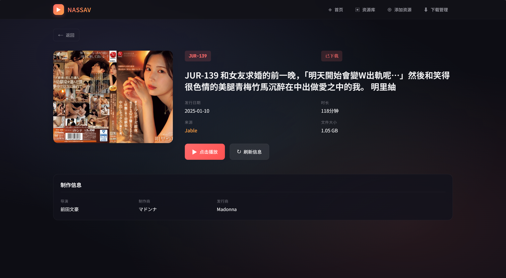
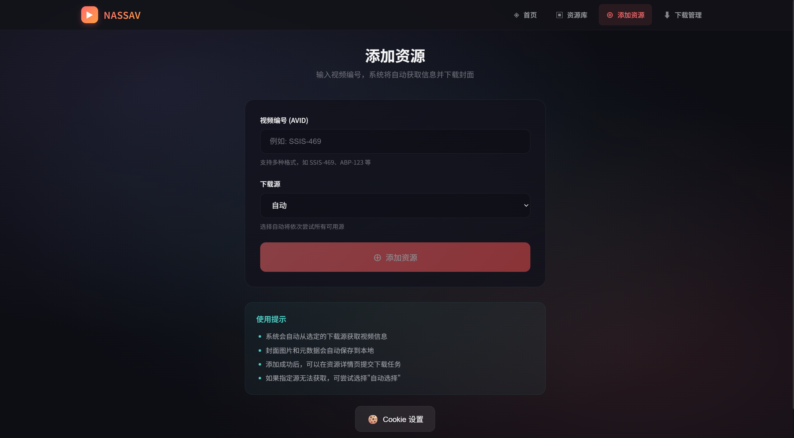
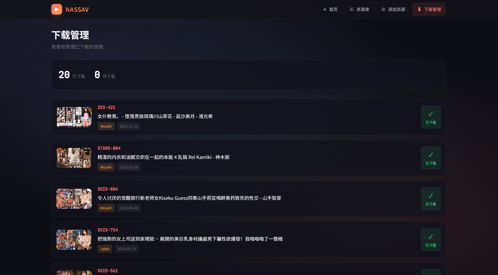

# NASSAV - AV 资源管理系统

一个功能完整的全栈视频资源管理系统，支持多源资源获取、元数据刮削、异步下载队列、实时进度追踪以及现代化的 Web 界面管理。

> **原仓库**：本项目基于 [Satoing/NASSAV](https://github.com/Satoing/NASSAV) 重构开发，原项目保留在 `origin_project/` 目录下。

## 项目概览

NASSAV 是一个功能完整的视频资源管理系统，包括：

- **后端服务**（Django + Celery + WebSocket）：提供 RESTful API、异步下载队列、实时进度追踪、元数据管理
- **前端应用**（Vue 3 + Vite）：现代化的 SPA 界面，支持资源浏览、按演员/类别聚合、搜索过滤、批量操作
- **原项目**：原始 Python 实现，作为参考保留

## 功能特性

### 🎬 核心功能

- **多源资源获取**：支持 8+ 视频源（Jable、MissAV、Memo 等），自动按权重遍历获取
- **元数据刮削**：从 JavBus 等站点获取详细信息（发行日期、时长、演员、类别、封面等）
- **异步下载队列**：基于 Celery 的异步任务系统，支持 M3U8 流媒体下载
- **实时进度追踪**：从 N_m3u8DL-RE 解析下载进度，支持 REST API 查询和 WebSocket 实时推送
- **智能去重机制**：多层去重检查（Redis 锁 + Celery 队列检查），确保同一 AVID 在队列中只出现一次
- **全局下载锁**：确保同一时间只有一个下载任务执行，避免 N_m3u8DL-RE 多实例并发
- **并发控制**：Celery Worker 配置为单并发，下载任务串行执行
- **统一资源管理**：按 AVID 分目录存储，封面/视频/元数据集中管理
- **WebSocket 实时通知**：前端可实时接收任务状态、下载进度、完成通知

### 🖥️ 前端界面

- **资源浏览**：卡片式展示，支持搜索（AVID/标题）、过滤（状态/来源）、排序（日期/编号/来源）
- **演员聚合**：按演员分类浏览，展示每个演员的作品数，支持搜索和排序
- **类别聚合**：按类别分类浏览，展示每个类别的作品数，支持搜索和排序
- **批量操作**：批量下载、批量刷新、批量删除，支持选择模式
- **资源详情**：查看完整元数据（封面、演员、类别、文件大小等），一键下载或刷新
- **添加资源**：选择下载源添加新资源，实时显示封面下载/元数据保存/信息刮削状态
- **下载管理**：查看已下载清单，快速复制本地文件路径
- **Cookie 管理**：为需要认证的下载源设置 Cookie

## 页面预览

### 首页

展示资源总览统计、最近添加的资源以及快捷操作入口。



### 资源库

支持按 AVID/标题/来源搜索，按状态过滤，按日期/编号/来源排序，提供批量操作（下载、刷新、删除），支持按演员/类别分类浏览。



### 演员库

展示所有演员及其作品数，支持搜索演员名称，按作品数或名称排序，点击演员卡片可查看该演员的所有作品。



### 资源详情

展示完整的元数据信息，包括封面、演员、类别、文件大小等，支持下载和刷新操作。



### 添加资源

输入 AVID 并选择下载源，实时显示封面下载、元数据保存、信息刮削状态。



### 下载管理

查看已下载的资源列表，快速跳转到资源详情页。



## 技术栈

### 后端（django_backend/）

| 组件                  | 版本  | 说明                                |
| --------------------- | ----- | ----------------------------------- |
| Python                | 3.12+ | 运行环境                            |
| Django                | 5.1+  | Web 框架                            |
| Django REST Framework | 3.15+ | API 框架                            |
| Django Channels       | 4.3+  | WebSocket 支持                      |
| Celery                | 5.4+  | 异步任务队列                        |
| Redis                 | -     | 消息队列 & 分布式锁 & Channel Layer |
| curl_cffi             | -     | HTTP 请求（绕过反爬）               |
| N_m3u8DL-RE           | -     | M3U8 下载工具                       |

### 前端（vue_frontend/）

| 组件       | 版本 | 说明      |
| ---------- | ---- | --------- |
| Vue 3      | -    | 前端框架  |
| Vite       | 5+   | 构建工具  |
| Pinia      | -    | 状态管理  |
| Vue Router | -    | 路由管理  |
| Axios      | -    | HTTP 请求 |

## 项目结构

```bash
NASSAV/
├── django_backend/          # Django 后端服务
│   ├── config/             # 配置文件
│   │   ├── config.yaml    # 应用配置
│   │   └── template-config.yaml  # 配置模板
│   ├── django_project/     # Django 项目配置
│   │   ├── settings.py    # Django 配置
│   │   ├── celery.py      # Celery 配置
│   │   └── asgi.py        # ASGI 配置（WebSocket）
│   ├── nassav/             # 主应用
│   │   ├── m3u8downloader/ # M3U8 下载器
│   │   ├── scraper/        # 元数据刮削器（JavBus等）
│   │   ├── source/         # 8 个下载源（Jable、MissAV等）
│   │   ├── models.py       # 数据模型（AVResource、Actor、Genre）
│   │   ├── views.py        # API 视图
│   │   ├── services.py     # 业务逻辑
│   │   ├── tasks.py        # Celery 异步任务
│   │   ├── consumers.py    # WebSocket 消费者
│   │   └── urls.py         # API 路由
│   ├── resource/           # 资源存储目录（新布局）
│   │   ├── cover/         # 封面图片，格式：{AVID}.jpg
│   │   │   └── thumbnails/ # 缩略图（small/medium/large）
│   │   ├── video/         # 视频文件，格式：{AVID}.mp4
│   │   └── resource_backup/ # 旧布局备份（HTML/JSON/MP4）
│   ├── tools/              # 工具目录
│   │   └── N_m3u8DL-RE   # M3U8 下载工具
│   ├── doc/               # 文档
│   │   ├── interface.md   # API 接口文档
│   │   ├── recommendation.md # 推荐系统设计文档
│   │   └── database.md    # 数据库文档
│   └── scripts/           # 实用脚本
├── vue_frontend/           # Vue 前端应用
│   ├── src/
│   │   ├── views/         # 页面组件
│   │   │   ├── HomeView.vue          # 首页
│   │   │   ├── ResourcesView.vue     # 资源库
│   │   │   ├── ActorsView.vue        # 演员库
│   │   │   ├── GenresView.vue        # 类别库（待实现）
│   │   │   ├── ActorDetailView.vue   # 演员详情
│   │   │   ├── ResourceDetailView.vue # 资源详情
│   │   │   ├── AddResourceView.vue   # 添加资源
│   │   │   └── DownloadsView.vue     # 下载管理
│   │   ├── components/    # 通用组件
│   │   │   ├── ResourceCard.vue      # 资源卡片
│   │   │   ├── ActorGroupCard.vue    # 演员卡片
│   │   │   ├── GenreGroupCard.vue    # 类别卡片（待实现）
│   │   │   └── BatchControls.vue     # 批量操作控件
│   │   ├── stores/        # Pinia 状态管理
│   │   │   ├── resource.js           # 资源状态
│   │   │   ├── actorGroups.js        # 演员组状态
│   │   │   └── genreGroups.js        # 类别组状态（待实现）
│   │   ├── api/          # API 封装
│   │   └── router/       # 路由配置
│   └── public/preview/   # 预览截图
└── origin_project/         # 原始项目（保留）
```

## 快速开始

### 前置要求

- Python 3.12+
- Node.js 18+
- Redis
- pnpm（推荐）或 npm

### 1. 后端设置

#### 安装依赖

```bash
cd django_backend
uv sync  # 或 pip install -r requirements.txt
```

#### 配置文件

```bash
cp config/template-config.yaml config/config.yaml
# 编辑 config.yaml，配置代理、刮削器、下载源等
```

#### 下载工具

下载 [N_m3u8DL-RE](https://github.com/nilaoda/N_m3u8DL-RE/releases) 并放置到 `tools/` 目录：

```bash
mkdir -p tools
# 下载对应平台的 N_m3u8DL-RE 并放入 tools/
chmod +x tools/N_m3u8DL-RE  # Linux/macOS
```

#### 启动 Redis

```bash
# Ubuntu/Debian
sudo systemctl start redis

# macOS
brew services start redis

# Windows
# 使用 WSL 或下载 Windows 版 Redis
```

#### 启动 FlareSolverr（可选，用于绕过 Cloudflare）

MissAV 等站点受 Cloudflare 保护，启用 FlareSolverr 后系统可自动获取 cookie 并在被拦截时自动回退，无需手动操作。

```bash
# 使用 Docker 启动（推荐）
docker run -d \
  --name flaresolverr \
  -p 8191:8191 \
  -e LOG_LEVEL=info \
  --restart unless-stopped \
  ghcr.io/flaresolverr/flaresolverr:latest

# 验证服务是否正常
curl http://localhost:8191/health
# 期望返回: {"status":"ok","version":"..."}
```

然后在 `config/config.yaml` 中启用：

```yaml
FlareSolverr:
  Enable: true
  url: http://localhost:8191
  timeout: 60000 # 等待 Cloudflare 验证的最长时间（毫秒）
```

> **注意**：`cf_clearance` cookie 与 FlareSolverr 浏览器的 TLS 指纹绑定，系统会自动通过 FlareSolverr 代理页面请求，无需额外配置。

#### 启动服务

### 方式一：使用 ASGI 服务器（推荐，支持 WebSocket）

```bash
# 使用 Uvicorn（推荐）
uv run uvicorn django_project.asgi:application --host 0.0.0.0 --port 8000 --reload

# 或使用 Daphne
uv run daphne -b 0.0.0.0 -p 8000 django_project.asgi:application
```

### 方式二：使用 Django 开发服务器（不支持 WebSocket）

```bash
uv run python manage.py runserver 0.0.0.0:8000
```

**注意**：如果要使用 WebSocket 实时通知功能，必须使用 ASGI 服务器（Uvicorn 或 Daphne）。

#### 启动 Celery Worker（异步下载）

```bash
# 标准启动（已配置单并发）
uv run celery -A django_project worker -l info

# 或手动指定并发数为 1
uv run celery -A django_project worker -l info --concurrency=1
```

**重要说明**：

- Worker 已配置为单并发模式（`CELERY_WORKER_CONCURRENCY=1`）
- 全局下载锁确保同一时间只有一个 N_m3u8DL-RE 实例在运行
- 任务去重机制防止同一 AVID 重复提交到队列

#### 启动 Celery Beat（定时任务）

Celery Beat 负责按计划触发定时任务（数据备份、一致性检查等），需要与 Worker 同时运行。

```bash
# 启动 Beat 调度器（需与 Worker 同时运行）
uv run celery -A django_project beat -l info \
  --scheduler django_celery_beat.schedulers:DatabaseScheduler

# 或使用默认调度器（无需数据库）
uv run celery -A django_project beat -l info
```

> Beat 进程只负责触发任务，实际执行仍由 Worker 完成，两者必须同时运行。

### 2. 前端设置

#### 安装依赖

```bash
cd vue_frontend
pnpm install  # 或 npm install
```

#### 启动开发服务器

```bash
pnpm dev  # 默认端口 8080
```

开发代理已配置：`/nassav` → `http://localhost:8000`

### 3. 访问应用

打开浏览器访问：<http://localhost:8080>

## 定时任务（Celery Beat）

系统内置 6 个定时任务，由 Celery Beat 按计划自动触发，报告文件保存在 `django_backend/celery_beat/` 目录。

| 任务名                              | 触发时间   | 说明                                                                    |
| ----------------------------------- | ---------- | ----------------------------------------------------------------------- |
| `backup-database-daily`             | 每天 01:30 | 备份 SQLite 数据库文件（含 WAL/SHM），保留最近 30 天                    |
| `backup-avid-list-daily`            | 每天 02:00 | 将所有 AVID 导出为文本文件，用于灾难恢复，保留最近 30 天                |
| `check-resources-consistency-daily` | 每天 03:00 | 检查封面/视频文件与数据库字段的一致性，自动修复不一致项                 |
| `sync-backups-daily`                | 每天 04:00 | 将 `backup/`、`celery_beat/`、`log/` 同步到 `BackupPath` 配置的外部目录 |
| `db-disk-consistency-daily`         | 每天 07:00 | 检查视频文件是否存在于磁盘，更新 `file_exists` 字段                     |
| `actor-avatars-consistency-daily`   | 每天 07:05 | 检查演员头像文件完整性，报告缺失项                                      |

### 配置说明

定时任务的调度计划在 `django_project/settings.py` 的 `CELERY_BEAT_SCHEDULE` 中定义，修改后重启 Beat 进程生效。

`sync-backups-daily` 需要在 `config.yaml` 中配置目标目录：

```yaml
BackupPath: /path/to/external/backup # 外部备份目录，null 表示禁用同步
```

### 手动触发

定时任务也可以通过 Django shell 手动触发：

```bash
# 手动触发数据库备份
uv run python manage.py backup_database --days 30

# 手动触发 AVID 列表备份
uv run python manage.py backup_avid_list --days 30

# 手动检查资源一致性（只报告，不修复）
uv run python manage.py check_videos_consistency --report celery_beat/report.json

# 手动检查并修复资源一致性
uv run python manage.py check_videos_consistency --apply

# 手动检查演员头像一致性
uv run python manage.py check_actor_avatars_consistency --report celery_beat/avatars.json
```

## API 文档

详细接口说明请参考：

- [django_backend/doc/interface.md](django_backend/doc/interface.md) - API 接口文档
- [django_backend/doc/recommendation.md](django_backend/doc/recommendation.md) - 推荐系统设计与接口文档
- [django_backend/doc/database.md](django_backend/doc/database.md) - 数据库模型文档

### REST API 端点

| 方法   | 端点                           | 说明                                   |
| ------ | ------------------------------ | -------------------------------------- |
| GET    | `/api/source/list`             | 获取可用下载源列表                     |
| POST   | `/api/source/cookie`           | 设置下载源 Cookie                      |
| GET    | `/api/resources/`              | 资源列表（支持搜索/筛选/分页/排序）    |
| GET    | `/api/recommendations/`        | 统一推荐入口                           |
| GET    | `/api/recommendations/options` | 获取可用推荐器与推荐策略               |
| GET    | `/api/recommendations/cover`   | 代理并缓存推荐封面                     |
| GET    | `/api/recommendations/demo`    | 兼容旧调用方式的 demo 推荐入口         |
| GET    | `/api/actors/`                 | 演员列表（支持搜索/分页/排序）         |
| GET    | `/api/genres/`                 | 类别列表（支持搜索/分页/排序，待实现） |
| GET    | `/api/resource/cover`          | 获取封面图片（支持多尺寸）             |
| GET    | `/api/resource/<avid>/preview` | 资源详情首屏预览                       |
| POST   | `/api/resource`                | 添加新资源                             |
| POST   | `/api/resource/refresh/<avid>` | 刷新资源元数据                         |
| DELETE | `/api/resource/<avid>`         | 删除资源                               |
| POST   | `/api/resources/batch`         | 批量资源操作（add/refresh/delete）     |
| GET    | `/api/downloads/list`          | 获取已下载列表                         |
| GET    | `/api/downloads/abspath`       | 获取视频文件绝对路径                   |
| POST   | `/api/downloads/<avid>`        | 提交下载任务                           |
| DELETE | `/api/downloads/<avid>`        | 删除已下载视频                         |
| POST   | `/api/downloads/batch_submit`  | 批量提交下载任务                       |
| GET    | `/api/tasks/queue/status`      | 获取任务队列状态（含进度）             |

### WebSocket 端点

| 端点                                   | 说明                           |
| -------------------------------------- | ------------------------------ |
| `ws://localhost:8000/nassav/ws/tasks/` | 实时任务队列通知和下载进度推送 |

**消息类型**：

- `progress_update` - 下载进度实时更新（百分比、速度）
- `task_started` - 任务开始通知
- `task_completed` - 任务完成通知
- `task_failed` - 任务失败通知
- `queue_status` - 队列状态更新

## 生产部署

### 后端部署

**使用 ASGI 服务器（支持 WebSocket）：**

```bash
# 使用 Uvicorn（推荐）
uvicorn django_project.asgi:application --host 0.0.0.0 --port 8000 --workers 4

# 或使用 Daphne
daphne -b 0.0.0.0 -p 8000 django_project.asgi:application

# Celery Worker（后台运行）
celery -A django_project worker -l info --detach --concurrency=1
```

**使用传统 WSGI 服务器（不支持 WebSocket）：**

```bash
# 使用 Gunicorn
gunicorn django_project.wsgi:application --bind 0.0.0.0:8000 --workers 4

# Celery Worker（后台运行）
celery -A django_project worker -l info --detach --concurrency=1
```

### 前端部署

```bash
cd vue_frontend
pnpm build  # 构建到 dist/
```

使用 Nginx 部署示例：

```nginx
server {
  listen 80;
  server_name your-domain.com;

  # 前端静态文件
  root /var/www/nassav/vue_frontend/dist;
  index index.html;

  # SPA 路由回退
  location / {
    try_files $uri $uri/ /index.html;
  }

  # API 反向代理
  location /nassav/ {
    proxy_pass http://127.0.0.1:8000/;
    proxy_http_version 1.1;
    # WebSocket 支持
    proxy_set_header Upgrade $http_upgrade;
    proxy_set_header Connection "upgrade";
    proxy_set_header Host $host;
    proxy_set_header X-Real-IP $remote_addr;
    proxy_set_header X-Forwarded-For $proxy_add_x_forwarded_for;
    proxy_set_header X-Forwarded-Proto $scheme;
  }
}
```

## 常见问题

### 后端相关

**Q: Celery 任务队列中出现重复任务？**

A: 系统已实现多层去重机制（Redis 锁 + Celery 队列检查），正常情况下不会出现重复。如果仍有问题，检查 Redis 连接状态。

**Q: 下载任务卡住不动？**

A: 检查 N_m3u8DL-RE 是否正确安装，查看 Celery Worker 日志，确认全局下载锁是否正常释放。可以通过 Redis 手动清理锁：`redis-cli DEL nassav:global_download_lock`。

**Q: WebSocket 连接失败？**

A: 确保使用 ASGI 服务器（Uvicorn 或 Daphne），而不是传统的 WSGI 服务器。检查 Nginx 配置是否包含 WebSocket 支持的头信息。

**Q: 某些源无法获取资源？**

A: 部分源需要 Cookie 才能访问。各源情况如下：

- **missav**：品类最全，启用 FlareSolverr 后可自动获取 cookie（推荐）；未启用时需在设置页手动填写
- **jable**：品类较全，可自动获取 cookie，无需额外配置
- **memo**：无需 cookie，但没有中文字幕

**Q: FlareSolverr 启动后 MissAV 仍然返回 403？**

A: `cf_clearance` cookie 与 FlareSolverr 浏览器的 TLS 指纹绑定，不能直接用 curl_cffi 携带该 cookie 请求。系统已自动处理此问题——被拦截时会通过 FlareSolverr 代理整个页面请求，无需手动干预。如果仍有问题，检查 FlareSolverr 服务是否正常运行（`curl http://localhost:8191/health`）。

### 前端相关

**Q: 刷新页面出现 404？**

A: SPA 应用需要配置服务器将所有路径回退到 `index.html`（参考上方 Nginx 配置）。

**Q: 接口请求失败或跨域？**

A: 确认后端服务正在运行，检查代理配置（开发环境）或 CORS 设置（生产环境）。

**Q: 开发端口冲突？**

A: 修改 `vue_frontend/vite.config.js` 中的 `server.port`。

**Q: 实时进度不更新？**

A: 确保后端使用 ASGI 服务器，前端 WebSocket 连接成功。可以在浏览器开发者工具的网络标签中查看 WebSocket 连接状态。

### 下载源相关

**Q: 哪些源比较好用？**

A: 就目前来说，**missav** 品类最全但是需要手动获取设置 cookie，**jable** 其次并且可以自动获取 cookie，**memo** 不需要设置 cookie 但是没有中文字幕，其余的源缺乏良好支持。

## 开发指南

### 添加新的下载源

1. 在 `django_backend/nassav/source/` 创建新的源类，继承 `SourceBase`
2. 实现 `get_download_info()` 方法
3. 在 `SourceManager` 中注册新源
4. 在 `config.yaml` 中配置权重

### 添加新的刮削器

1. 在 `django_backend/nassav/scraper/` 创建新的刮削器类
2. 实现元数据解析逻辑
3. 在 `ScraperManager` 中注册

### 实时进度追踪

系统通过以下方式实现下载进度的实时追踪：

1. **进度解析**：从 N_m3u8DL-RE 的标准输出实时解析进度信息（百分比、速度）
2. **Redis 存储**：将进度数据存储到 Redis，键名格式：`nassav:task_progress:{AVID}`
3. **WebSocket 推送**：每次进度更新时通过 Channel Layer 推送到所有连接的客户端
4. **REST API 查询**：通过 `GET /api/tasks/queue/status` 查询当前任务进度
5. **自动清理**：任务完成后自动删除进度数据，或 1 小时后自动过期

#### 前端集成示例

**WebSocket 实时订阅（推荐）：**

```javascript
const ws = new WebSocket('ws://localhost:8000/nassav/ws/tasks/')

ws.onmessage = (event) => {
  const message = JSON.parse(event.data)

  switch (message.type) {
    case 'progress_update':
      // 实时进度更新
      const { avid, percent, speed } = message.data
      console.log(`${avid}: ${percent}% @ ${speed}`)
      updateProgressBar(avid, percent)
      break

    case 'task_completed':
      // 下载完成
      console.log(`Task ${message.data.avid} completed`)
      break

    case 'queue_status':
      // 队列状态更新
      updateQueueDisplay(message.data)
      break
  }
}
```

**REST API 轮询（备选）：**

```javascript
// 定期查询任务状态（包含进度信息）
setInterval(async () => {
  const response = await fetch('/nassav/api/tasks/queue/status')
  const { data } = await response.json()

  data.active_tasks.forEach((task) => {
    if (task.progress) {
      console.log(`${task.avid}: ${task.progress.percent}%`)
      updateProgressBar(task.avid, task.progress.percent)
    }
  })
}, 2000) // 每 2 秒查询一次
```

### 任务去重与并发控制

系统采用多层去重策略，确保同一 AVID 在整个任务队列中只出现一次：

1. **Redis 任务锁**：提交任务时创建 `nassav:task_lock:{AVID}` 键
2. **Celery 队列检查**：检查 active、scheduled、reserved 三种状态的任务
3. **参数精确匹配**：通过任务名称和 AVID 参数精确识别重复任务

全局下载锁确保同一时间只有一个下载任务在执行，避免 N_m3u8DL-RE 多实例并发导致的资源竞争。

## 版本更新

### v2.1.0（2026-04-17）

#### 🆕 新增

- **外部搜索详情能力（首期 Jable）**：新增演员详情与类别详情的外部搜索聚合接口，支持多源扩展架构（Jable 已实现，其他源保留占位）。
- **开放 API 文档**：新增 OpenAPI Schema 与文档页，可通过 docs 页面直接查看和调试接口。
- **外部搜索缓存层**：在 Jable 搜索与推荐召回链路加入页面级缓存，详情页与推荐页共享收益，降低重复抓取开销。

#### 🔧 优化

- **路径规范统一**：推荐、演员、类别等核心接口统一为无尾斜杠主路径，并保持兼容路径，前后端调用同步更新。
- **外部结果字段精简**：详情外部搜索结果聚焦核心展示字段，新增 in_library 标记用于快速判断是否已在本地库。
- **单用户 NAS 场景适配**：缓存策略收敛为低复杂度单层方案，默认可控、易维护，并支持强制刷新重新抓取。
- **推荐链路联动刷新**：推荐接口支持强制绕过外部缓存，前端推荐页与详情页提供“刷新外部结果”触发入口。

#### 🎨 前端体验

- **详情页外部搜索增强**：演员详情页与类别详情页支持外部结果排序切换、分页浏览与手动刷新。
- **推荐页交互增强**：推荐页新增外部刷新入口，保留个性化参数面板并优化结果续推行为。

#### 🐛 修复

- 修复外部搜索与推荐链路中因接口参数/路径不一致导致的联调问题。
- 修复 OpenAPI 在部分 APIView 上无法推断 serializer 的文档生成告警。
- 修复推荐与外部搜索相关测试桩签名不一致导致的回归风险。

#### 📚 文档

- 更新根 README 与接口文档，补充 v2.1.0 能力说明、外部搜索参数与缓存刷新语义。

### v2.0.0（2026-03-29）

#### 🆕 新增

- **推荐系统主链路**：新增基于本地高频演员/类别与 Jable 搜索结果的 demo 推荐系统
  - 后端新增 `RecommenderManager`、`RecommendationStrategy`、`AbstractRecommender` 等分层结构
  - 当前提供 `jable_search` recommender 与 `local_preference` strategy，可继续扩展更多推荐器与策略
  - `Jable.search()` 已支持直接解析站内搜索结果页，输出统一候选结构
- **推荐接口**：新增推荐相关 REST API
  - `GET /api/recommendations/`
  - `GET /api/recommendations/options`
  - `GET /api/recommendations/cover`
  - `GET /api/recommendations/demo`
- **推荐页前端界面**：新增独立推荐页与导航入口
  - 支持选择 recommender / strategy / 返回数量
  - 支持手动触发推荐、查看推荐理由、直接加入资源库
  - 已对“当前会话已添加资源”做前端隐藏处理
- **推荐封面代理缓存**：新增后端推荐封面代理与缓存，避免前端直接请求 Jable 资源导致在中国大陆无法加载

#### 🔧 优化

- **推荐结果过滤**：推荐请求默认过滤本地已存在资源，并将 `exclude_existing` 暴露为显式请求参数
- **推荐信息说明**：推荐接口返回 recommender / strategy 的名称与说明，前端可直接渲染说明文本
- **前端交互收敛**：推荐页改为手动触发请求，合并重复的选择与展示区，卡片中的评分与理由展示更紧凑
- **视觉细节调整**：补充浅色模式颜色修正，并优化推荐页选择区对齐

#### 🐛 修复

- 修复定时清理任务未正确清理过期日志文件的问题

#### 📚 文档

- 新增推荐系统设计文档：`django_backend/doc/recommendation.md`
- 更新根 README、接口文档与 REST API 端点列表，补充推荐系统相关说明

### v1.4.0（2026-02-25）

#### 🆕 新增

- **移动端适配**：全面支持小屏幕设备
  - Navbar 新增汉堡菜单，移动端下折叠为抽屉式导航，路由切换自动关闭
  - BatchControls、ResourceSearchBar、ResourcePagination 均改为自动换行布局，避免溢出
  - 演员详情页、类别详情页新增返回按钮，样式与资源详情页保持一致
- **无障碍支持（Accessibility）**
  - 刷新/删除等图标按钮补充 `aria-label`、`aria-haspopup`、`aria-expanded`
  - 下拉菜单添加 `role="menu"` / `role="menuitem"` 语义
  - ConfirmDialog 添加 `role="dialog"`、`aria-modal`、`aria-labelledby`、`aria-describedby`
  - Toast 通知容器添加 `aria-live="polite"`，错误类型使用 `role="alert"`
  - 下拉菜单与对话框支持 Esc 键关闭

#### 🔧 优化

- **下载按钮 Loading 状态**：点击下载后按钮立即显示旋转 spinner 及"下载中"文字，视频就绪后自动重置
- **批量选中高亮**：批量模式下选中的资源卡片显示高亮边框与外发光效果
- **下拉菜单智能定位**：刷新/删除下拉菜单在靠近视口顶部时自动向下翻转，避免被裁剪
- **Navbar 滚动阴影**：页面滚动超过 10px 时 Navbar 底部平滑出现阴影
- **演员头像懒加载**：ActorGroupCard 头像图片添加 `loading="lazy"`，减少初始加载开销
- **资源列表骨架屏**：切换筛选条件时以 shimmer 骨架屏替代 LoadingSpinner，消除内容闪烁

#### ♻️ 重构

- **颜色系统统一**：将所有 Views 层残留的硬编码 hex 颜色（`#ef4444`、`#4ecdc4` 等）全部替换为 CSS 变量
- **图标规范化**：将 Unicode 字符图标（◉ ◷ ✓ ✕ ⚠ ℹ）全部替换为 SVG 图标

---

### v1.3.9（2026-02-25）

#### 🆕 新增

- **FlareSolverr 集成**：支持通过 FlareSolverr 自动绕过 MissAV 的 Cloudflare 验证，无需手动获取 cookie
  - `MissAV.get_html()` 在 curl_cffi 被 Cloudflare 拦截（403/503）时自动回退到 FlareSolverr
  - `MissAV.set_cookie_auto()` 优先通过 FlareSolverr 获取 `cf_clearance` cookie 并持久化到数据库
  - 新增 `nassav/flaresolverr_client.py`，封装 FlareSolverr REST API
- **配置项**：`config.yaml` 新增 `FlareSolverr` 配置块（`Enable` / `url` / `timeout`）

---

### v1.3.8（2026-02-20）

#### 🆕 新增

- **批量添加错误详情展示**：批量添加资源时，失败的资源现在会直接在标签内显示具体错误码（如 `ABC-123:404`），并根据错误类型使用不同颜色标识（404-橙色、403-紫色、502-黄色、500-深红色）

#### 🔧 优化

- **简化操作流程**：移除添加资源结果页面的"继续添加"按钮，简化用户操作流程

---

### v1.3.7（2026-02-09）

#### 🆕 新增

- **字体选择功能**：在设置页面新增字体样式选择，支持 Mplus2、TheWriteRight、ZenKakuGothicNew 三种字体，提供实时预览功能
- **后端搜索功能**：将搜索功能从前端移至后端，支持对 `original_title`、`source_title`、`translated_title` 三个标题字段进行模糊搜索，提升搜索性能和准确性

#### 🔧 修复

- **时间字段更新bug**：修复刷新资源时错误更新 `metadata_created_at` 字段的问题，确保创建时间只在资源首次创建时设置
- **测试环境隔离**：修复测试运行时覆盖生产环境 `user_settings.ini` 配置文件的问题，测试现在使用独立的临时配置文件
- **导航栏高亮bug**：修复资源库下拉菜单中"全部资源"选项始终高亮的问题，现在只在当前页面时才高亮

#### ⚡ 改进

- **搜索图标优化**：将搜索栏中的搜索图标从 Unicode 字符替换为 SVG 图标，尺寸放大并优化垂直居中显示

---

### v1.3.5（2026-01-10）

#### 🆕 新增

- **观看和收藏状态管理**：为资源添加 `watched`（已观看）和 `is_favorite`（已收藏）字段
- **状态切换功能**：资源详情页新增收藏和观看状态按钮，支持一键切换
- **状态过滤**：资源列表支持按观看状态和收藏状态过滤（已观看/未观看/已收藏）
- **状态更新接口**：新增 `PATCH /api/resource/{avid}/status` 接口用于更新资源状态

#### 🔧 修复

- **时间字段语义修正**：
  - 将 `metadata_saved_at` 重命名为 `metadata_updated_at`（元数据最后更新时间）
  - 新增 `metadata_created_at` 字段（元数据首次创建时间）
  - 修复了时间字段语义不清的问题
- **状态显示修复**：修复资源详情页初始状态不随后端数据更新的问题
- **遗留字段清理**：清理所有代码中对旧字段 `metadata_saved_at` 的引用

#### ⚡ 改进

- **排序功能增强**：
  - 资源列表支持按元数据创建时间排序
  - 资源列表支持按元数据更新时间排序
- **UI 优化**：
  - 收藏和观看按钮移至封面下方，使用 `justify-between` 布局
  - 按钮显示文字标签和图标，状态更直观
  - 激活状态有背景色高亮（收藏：红色，观看：绿色）
- **文档更新**：更新接口文档，补充新字段和过滤参数说明

---

### v1.3.2（2026-01-05）

#### 🆕 新增

- 添加定时备份任务（`backup-database-daily` / `backup-avid-list-daily` / 同步任务支持）
- 配置项调整：将 `UrlPrefix` 重命名为 `FilePathPrefix`，新增 `BackupPath` 用于 `sync_backups` 命令目标目录
- 将批量删除操作拆分为 `delete-video` 与 `delete-all`，以便更精细的删除控制

#### 🐛 Bug 修复

- 修复前端 Cookie 显示错误和后端未正确设置 Cookie 的问题，同时为部分请求添加 `Referer` 头以提升来源兼容性
- 删除资源时同时清理缩略图（修复遗漏的缩略图删除逻辑）
- 移除 GET 资源接口的 `search` 查询参数（由前端的模糊搜索逻辑替代）

#### ⚡ 改进

- 启用 SQLite 的 WAL 模式以提升可恢复性与并发表现
- 新增数据库、AVID 列表与资源一致性检查的定时任务，并统一日志持久化与 30 天保留策略

---

### v1.3.0（2026-01-03）

#### 🆕 新功能

**系统设置页面：**

- ⚙️ **设置页面**：新增独立设置页（`/settings`），集中管理 Cookie 和系统配置
- 🍪 **Cookie 管理模块**：查看、设置、自动获取、删除下载源 Cookie，实时显示状态
- 📝 **用户设置持久化**：通过 `/api/setting` 接口将前端配置保存到后端 `user_settings.ini`
- 🎨 **通用设置**：支持控制女优头像显示、选择标题显示字段（原始/源站/翻译）

**女优头像功能：**

- 🖼️ **Javbus 头像集成**：自动从 Javbus 获取女优头像并保存到本地
- 👤 **头像显示**：演员列表和详情页支持显示女优头像（可通过设置开关）
- 🔍 **头像筛选**：演员列表支持 `has_avatar` 参数按头像状态筛选
- 🎯 **智能降级**：无头像时显示文字占位符

**封面与标题优化：**

- 📷 **Javbus 封面优先**：优先使用 Javbus 封面（质量更稳定），403 错误时自动回退到源站封面
- 🏷️ **多标题支持**：后端同时返回原始标题、源站标题、翻译标题，前端可选显示

#### 🐛 Bug 修复

- 🔧 修复 Javbus 女优名解析问题：正确处理带括号的女优名（如"めぐり（藤浦めぐ）"）
- 🔧 修复视频时间排序接口返回未下载资源：`sort_by=video_create_time` 时自动过滤
- 🔧 修复后端女优头像处理逻辑，确保头像正确保存和 API 返回
- 🔧 过滤无作品的演员，避免空数据显示

#### ⚡ 优化改进

- 🔍 女优名解析增强：改进正则表达式以支持复杂括号内容和特殊字符
- 🎯 封面下载鲁棒性：添加 HTTP 403 错误处理和自动重试机制
- 📊 API 增强：女优列表接口支持更多筛选条件
- 🧹 接口整合：移除冗余的 Cookie 设置功能，统一到设置页管理

---

### v1.2.0（2026-01-02）

#### 🎯 核心功能增强

**后端新特性：**

- ✨ **细粒度刷新控制**：支持独立刷新 m3u8、元数据、翻译（3个开关互不干扰）
- 🔄 **批量操作接口**：支持批量添加、刷新、删除资源，批量提交下载任务
- 🌐 **AI 智能翻译系统**：基于 Ollama 的日译中标题翻译，支持批量翻译和异步任务
- 🗂️ **source_title 规范化**：统一 AVID 格式（大写 + 前缀），保证数据一致性
- 📝 **DisplayTitle 配置**：支持通过配置文件选择显示标题类型（source_title/translated_title/title）
- 🎛️ **Translator 配置系统**：支持多翻译器配置，可通过 config.yaml 激活不同模型

**前端新特性：**

- ✨ **批量添加资源**：支持一次性输入多个 AVID（换行、逗号或空格分隔），自动去重和格式化
- 🎨 **刷新操作多选项**：刷新元数据时可选择刷新方式（仅本地、Ollama、DeepL、ChatGPT等）
- 🏠 **首页美化**：采用渐变配色、浮动动画背景、现代化卡片设计
- 🎭 **类别标签优化**：以 hashtag 形式展示资源类别，更直观
- 🧭 **导航菜单增强**：资源库新增下拉菜单，可快速导航至"按演员"和"按类别"视图
- ↩️ **返回逻辑优化**：返回按钮跳转至来源页面而非固定路由

#### 🐛 Bug 修复

- 🔧 **下载队列显示修复**：修复任务队列显示 Bug（任务数量和状态显示错误）
- 🔄 **WebSocket 连接优化**：改进 WebSocket 连接和 HTTP 轮询逻辑
- 🏷️ **任务状态同步**：改进任务状态同步机制，添加 AVID-名称缓存，减少重复请求

#### ⚡ 性能优化

- 🖼️ **封面加载优化**：优先使用后端提供的 thumbnail_url，减少 Blob 下载
- 💾 **智能缓存策略**：AVID-名称映射缓存，避免重复请求元数据
- 🧹 **翻译质量提升**：添加翻译结果清洗机制（10+ 清洗规则），移除前缀、注释、格式标记
- 🔄 **条件请求优化**：元数据和封面接口支持 ETag/Last-Modified，减少带宽占用

#### 📊 数据库与架构

- 📑 **数据库全面迁移**：所有元数据从文件系统迁移至 SQLite，统一通过 ORM 访问
- 🏷️ **演员类别聚合**：新增演员列表、类别列表 API，支持按作品数排序和搜索
- 🖼️ **智能缩略图生成**：按需生成多尺寸封面（small/medium/large），支持 ETag 缓存

#### 💻 代码质量提升

- ✅ **ESLint 代码检查**：配置 ESLint 9.39.2 + Vue 插件，添加 `pnpm lint` 和 `pnpm lint:fix` 命令
- 🧹 **代码清理**：移除未使用的变量、导入和函数，修复空 catch 块，添加缺失的 emits 声明
- 🔧 **代码优化**：移除无用的 try-catch 包装，修复模板变量遮蔽问题
- 🧪 **完整测试覆盖**：新增翻译清洗、序列化器、API 端点等测试用例

#### 📝 文档更新

- 📖 更新 API 文档，新增细粒度刷新、批量操作接口说明
- 📚 完善配置文档，添加翻译器和 DisplayTitle 配置说明
- 🗂️ 新增数据库迁移和规范化脚本文档

---

### v1.1.0

**新增功能：**

- ✨ **演员聚合浏览**：新增演员库页面，按演员分类浏览资源，支持搜索和排序
- ✨ **类别聚合浏览**：新增类别库页面（前端待完善），按类别分类浏览资源
- ✨ **演员/类别详情页**：点击演员/类别卡片可查看该演员/类别的所有作品
- ✨ **批量操作组件化**：封装统一的批量操作控件，支持批量下载、刷新、删除
- ✨ **实时进度追踪**：WebSocket 实时推送下载进度，支持百分比和速度显示
- 🔧 **后端 API 增强**：
  - `GET /api/actors/` - 演员列表及作品数统计
  - `GET /api/genres/` - 类别列表及作品数统计
  - `GET /api/resources/?actor=<id|name>` - 按演员过滤资源
  - `GET /api/resources/?genre=<id|name>` - 按类别过滤资源
  - `ws://host/nassav/ws/tasks/` - WebSocket 实时通知
- 🎨 **UI/UX 优化**：统一的卡片设计风格，更流畅的交互体验

**改进：**

- 📊 数据库结构优化：添加索引提升查询性能
- 🔒 增强的去重机制：多层去重保证任务唯一性
- 🚀 缩略图支持：封面支持多尺寸（small/medium/large）按需生成
- 📝 完善的文档：更新 API 文档和数据库文档

---

### v1.0.0

- 🎬 多源资源获取（8+ 下载源）
- 🔍 元数据刮削（JavBus 等）
- 📥 异步下载队列（Celery）
- 🖥️ 现代化前端界面（Vue 3 + Vite）
- 📁 统一资源管理

## 许可证

本项目基于原仓库 [Satoing/NASSAV](https://github.com/Satoing/NASSAV) 重构开发，遵循相同的许可证。

## 致谢

感谢 [Satoing/NASSAV](https://github.com/Satoing/NASSAV) 原项目的启发和基础代码。
